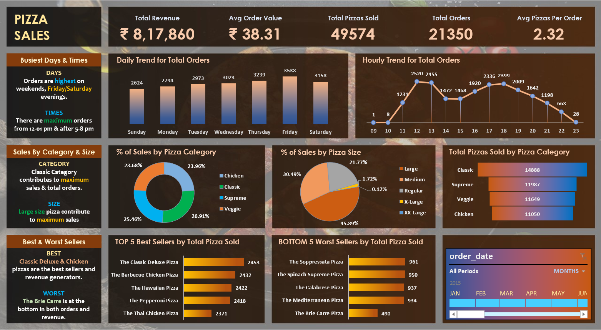

# Pizza Sales Performance Analysis (SQL & Excel)

## Project Overview
This project demonstrates a full-scale data analysis pipeline using a dataset of **48,000+ pizza sales records**. I managed the entire process: importing raw data, performing high-volume data processing in MySQL, and building a professional interactive dashboard in Excel for business reporting.

## Repository Contents
* **`pizza_sales.csv`**: The original dataset containing 48,000+ transaction rows.
* **`Pizza_sales.sql`**: MySQL scripts used to calculate KPIs and extract time-series trends.
* **`Pizza_Sales_DAHBOARD.xlsx`**: The final interactive Excel workbook with Pivot Tables and Slicers.

## Key Technical Highlights
* **High-Volume Data Processing:** Optimized SQL queries to analyze a 48,000+ row database for KPIs like Total Revenue, Average Order Value (AOV), and Total Pizzas Sold.
* **Complex SQL Analytics:** Identified peak order times and monthly growth trends using aggregate functions and date-time logic.
* **Interactive Visualization:** Built an Excel dashboard featuring **Timeline Slicers**, allowing stakeholders to filter performance by specific dates or pizza categories.
* **Inventory Insights:** Created visualizations for sales distribution by pizza size and category to assist in inventory forecasting.

## Tools Used
* **SQL (MySQL):** Data Extraction, KPI Calculation, Trend Analysis.
* **MS Excel:** Data Modeling, Pivot Tables, Interactive Dashboarding.

## Dashboard Preview

## Key Business Insights
* Discovered that orders peak significantly during evening hours, suggesting a need for increased kitchen staffing during those windows.
* Identified 'Classic' pizzas as the top revenue drivers, contributing the largest share to total sales.
